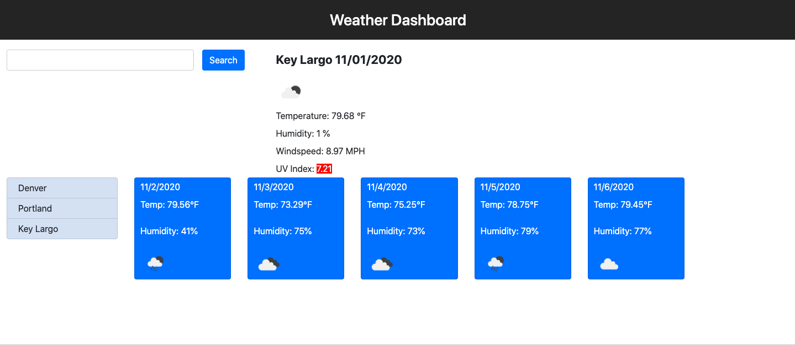

# weatherDashboard

This application provides the user with the ability to enter any city into the input field and have instant data about the weather at their hands. It will show a few current specific details about the city provided, such as temperature, humidity, wind speed, and the UV index. There is also a feature that shows the user the current 5 day forecast for their chosen city. Upon typing multiple cities the information is cleared put and refreshed with the most recent city's information. A list develops on the left of the users city history. This would be a wonderful addition to any company's webpage, particularly if it involves travel.

For this application I used API's from the following source for data retrieval:
(https://openweathermap.org/api)

**_Screenshot of the functioning application:_**

**_Deployed URL for the application:_**
[Weather Dashboard](https://amoseman1.github.io/weatherHW/)
